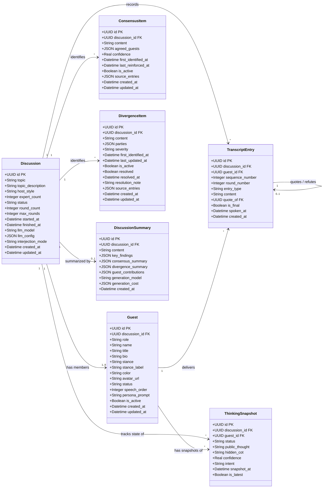
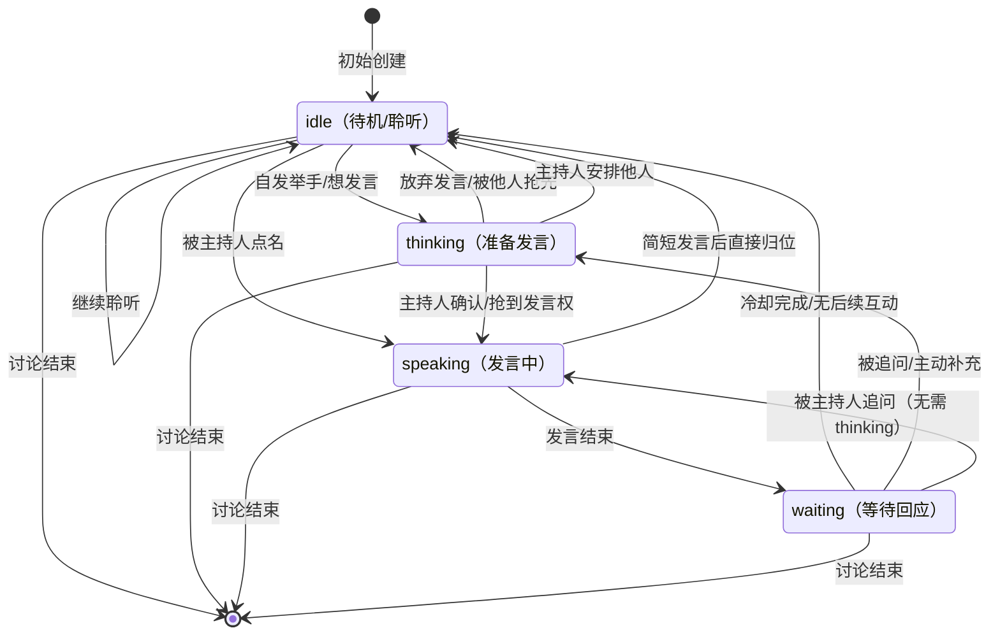
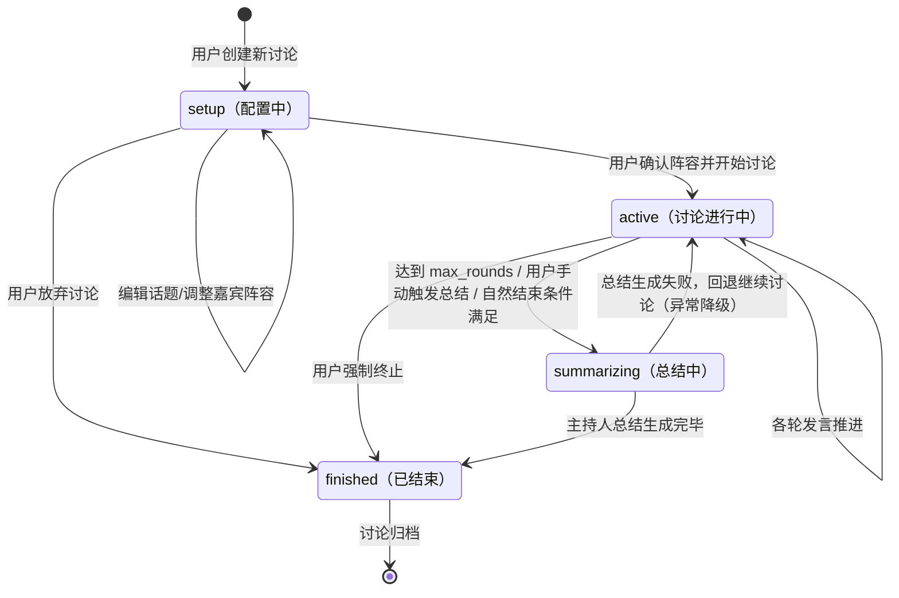

# AI Panel Studio — 领域建模与数据结构设计

> **SDD 第一阶段交付物** | 技术选型：Python FastAPI + SQLite + snake_case

---

## 目录

1. [核心实体定义](#1-核心实体定义)
   - [1.1 Discussion（讨论会话）](#11-discussion讨论会话)
   - [1.2 Guest（嘉宾：主持人和专家）](#12-guest嘉宾主持人和专家)
   - [1.3 TranscriptEntry（公开转录记录）](#13-transcriptentry公开转录记录)
   - [1.4 ThinkingSnapshot（嘉宾思考状态快照）](#14-thinkingsnapshot嘉宾思考状态快照)
   - [1.5 ConsensusItem（共识项）](#15-consensusitem共识项)
   - [1.6 DivergenceItem（分歧项）](#16-divergenceitem分歧项)
   - [1.7 DiscussionSummary（讨论总结）](#17-discussionsummary讨论总结)
2. [ER 图](#2-er-图)
3. [状态机设计](#3-状态机设计)
   - [3.1 Guest 状态机](#31-guest-状态机)
   - [3.2 Discussion 状态机](#32-discussion-状态机)
4. [关键疑问与建议方案](#4-关键疑问与建议方案)
5. [核心设计原则总结](#5-核心设计原则总结)

---

## 1. 核心实体定义

### 1.1 Discussion（讨论会话）

| 字段名 | 类型 | 约束 | 说明 |
|---|---|---|---|
| `id` | UUID / TEXT | PK, NOT NULL | 讨论会话唯一标识 |
| `topic` | TEXT | NOT NULL, 长度 1-200 | 讨论话题，如"AI会取代人类工作吗" |
| `topic_description` | TEXT | NULLABLE | 话题补充背景描述，提供给 LLM 构建上下文 |
| `host_style` | TEXT | NOT NULL, DEFAULT 'neutral' | 主持风格：neutral / provocative / socratic / humorous |
| `expert_count` | INTEGER | NOT NULL, MIN 2, MAX 8 | 专家嘉宾人数（不含主持人） |
| `status` | TEXT | NOT NULL, DEFAULT 'setup' | 状态机当前状态：setup / active / summarizing / finished |
| `round_count` | INTEGER | NOT NULL, DEFAULT 0 | 已完成的发言轮次计数 |
| `max_rounds` | INTEGER | NULLABLE | 最大发言轮次上限，NULL 表示无限制 |
| `started_at` | DATETIME | NULLABLE | 讨论实际开始时间 |
| `finished_at` | DATETIME | NULLABLE | 讨论结束时间 |
| `llm_model` | TEXT | NOT NULL | 使用的 LLM 模型标识，如 claude-sonnet-4-20250514 |
| `llm_config` | JSON / TEXT | NOT NULL, DEFAULT '{}' | LLM 调用参数的 JSON 配置（temperature, max_tokens 等） |
| `interjection_mode` | TEXT | NOT NULL, DEFAULT 'moderated' | 插话模式：moderated（主持人控制）/ free（专家自由插话）/ hybrid |
| `created_at` | DATETIME | NOT NULL, DEFAULT CURRENT_TIMESTAMP | 创建时间 |
| `updated_at` | DATETIME | NOT NULL, DEFAULT CURRENT_TIMESTAMP | 最后更新时间 |

**设计说明：**

- `status` 驱动整个讨论生命周期，状态转换需在 API 层做校验。
- `host_style` 和 `interjection_mode` 是核心游戏性参数，直接影响 LLM 提示词的生成策略。
- `llm_config` 使用 JSON 文本存储灵活性较高，SQLite 原生支持 JSON 函数（3.38+），可在查询层做部分解析。

---

### 1.2 Guest（嘉宾：主持人和专家）

| 字段名 | 类型 | 约束 | 说明 |
|---|---|---|---|
| `id` | UUID / TEXT | PK, NOT NULL | 嘉宾唯一标识 |
| `discussion_id` | UUID / TEXT | FK -> Discussion.id, NOT NULL | 所属讨论会话 |
| `role` | TEXT | NOT NULL, CHECK(role IN ('host','expert')) | 角色类型：host=主持人，expert=专家 |
| `name` | TEXT | NOT NULL, 长度 1-50 | 嘉宾姓名（LLM 生成或用户指定） |
| `title` | TEXT | NULLABLE | 职业/头衔，如"AI 伦理研究员" |
| `bio` | TEXT | NULLABLE | 简短背景介绍（1-3 句），用于 LLM 角色提示 |
| `stance` | TEXT | NOT NULL | 立场描述，如"强烈支持 AI 发展"、"谨慎乐观"、"反对派" |
| `stance_label` | TEXT | NULLABLE | 立场短标签，用于面板快速标识，如"正方"、"反方"、"中立观察者" |
| `color` | TEXT | NOT NULL, 格式 #RRGGBB | 颜色标识，用于前端色块区分（Hex 格式） |
| `avatar_url` | TEXT | NULLABLE | 头像 URL（可后期集成 DiceBear 等生成服务） |
| `status` | TEXT | NOT NULL, DEFAULT 'idle' | 当前状态：idle / thinking / speaking / waiting（详见状态机） |
| `speech_order` | INTEGER | NOT NULL | 在阵容中的展示顺序（主持人固定为 0） |
| `persona_prompt` | TEXT | NULLABLE | LLM 生成的人格提示词片段（完整 system prompt 由此组装） |
| `is_active` | BOOLEAN | NOT NULL, DEFAULT TRUE | 软删除/禁用标记 |
| `created_at` | DATETIME | NOT NULL, DEFAULT CURRENT_TIMESTAMP | 创建时间 |
| `updated_at` | DATETIME | NOT NULL, DEFAULT CURRENT_TIMESTAMP | 最后更新时间 |

**设计说明：**

- `role='host'` 的嘉宾 `speech_order` 固定为 0，每个 Discussion 有且仅有一个 host。
- `stance` 是自然语言描述（用于 LLM prompt），`stance_label` 是简短的UI标签。
- `color` 与 `role` 组合使用：主持人使用偏暖/中性色（如 #E8A840 金色），专家使用差异化鲜明的色调。
- `persona_prompt` 由 LLM 生成阵容时一次性产出，后续讨论中作为角色 system prompt 的核心组成部分。

**约束：**

- 每个 Discussion 的 host 唯一：`UNIQUE(discussion_id, role) WHERE role='host'`（应用层校验）。
- 专家人数 2-8 人，通过 API 创建时校验。

---

### 1.3 TranscriptEntry（公开转录记录）

| 字段名 | 类型 | 约束 | 说明 |
|---|---|---|---|
| `id` | UUID / TEXT | PK, NOT NULL | 转录条目唯一标识 |
| `discussion_id` | UUID / TEXT | FK -> Discussion.id, NOT NULL | 所属讨论会话 |
| `guest_id` | UUID / TEXT | FK -> Guest.id, NOT NULL | 发言嘉宾 |
| `sequence_number` | INTEGER | NOT NULL | 全局递增序号，用于前端按序渲染 |
| `round_number` | INTEGER | NOT NULL | 所属轮次号 |
| `entry_type` | TEXT | NOT NULL | 条目类型（见下表） |
| `content` | TEXT | NOT NULL | 公开发言内容（Markdown 格式） |
| `quote_of` | UUID / TEXT | NULLABLE, FK -> TranscriptEntry.id | 引用的前序发言（用于反驳/补充语义关联） |
| `is_final` | BOOLEAN | NOT NULL, DEFAULT FALSE | 是否为该 guest 本轮的最终定稿（流式过程中为 FALSE） |
| `spoken_at` | DATETIME | NOT NULL, DEFAULT CURRENT_TIMESTAMP | 发言时间戳 |
| `created_at` | DATETIME | NOT NULL, DEFAULT CURRENT_TIMESTAMP | 记录创建时间 |

**entry_type 枚举值：**

| 值 | 说明 |
|---|---|
| `opening_statement` | 主持人开场白 |
| `position_statement` | 专家立场陈述（第一轮） |
| `speech` | 常规发言 |
| `interjection` | 插话/打断 |
| `rebuttal` | 反驳 |
| `supplement` | 补充观点 |
| `question` | 主持人提问 |
| `answer` | 专家回答提问 |
| `closing_statement` | 总结陈述 |
| `host_summary` | 主持人总结 |

**设计说明：**

- `sequence_number` 为全局递增，保证前端按时间线渲染时不会乱序。
- `is_final` 支持流式输出场景：LLM 逐 token 生成时，前端创建一条 `is_final=FALSE` 的记录并持续更新 `content`；完成后置为 `is_final=TRUE`。
- `quote_of` 建立发言间的引用关系，可用于前端高亮被反驳/被补充的原发言。
- **前端可见性规则：** 所有 TranscriptEntry 对前端完全可见，不存在隐藏字段。内部事件（如 LLM 调用耗时、token 消耗等）不进入此表。

---

### 1.4 ThinkingSnapshot（嘉宾思考状态快照）⚠️ 安全敏感

| 字段名 | 类型 | 约束 | 说明 |
|---|---|---|---|
| `id` | UUID / TEXT | PK, NOT NULL | 快照唯一标识 |
| `discussion_id` | UUID / TEXT | FK -> Discussion.id, NOT NULL | 所属讨论会话 |
| `guest_id` | UUID / TEXT | FK -> Guest.id, NOT NULL | 所属嘉宾 |
| `status` | TEXT | NOT NULL, 与 Guest.status 同步 | 当前行为状态：idle / thinking / speaking / waiting |
| `public_thought` | TEXT | NULLABLE | **公开思考摘要**（发送到前端），用自然语言简述嘉宾当前在想/准备说什么，如"正在组织关于就业市场的论点" |
| `hidden_cot` | TEXT | NULLABLE | **隐藏推理链**（绝不发送到前端），LLM 的完整 CoT 输出，包含内部推理过程 |
| `confidence` | REAL | NULLABLE, CHECK(0 <= confidence <= 1) | LLM 对即将发言内容的确信度（0-1），可用于 UI 展示发言的坚定程度 |
| `intent` | TEXT | NULLABLE | 发言意图类型：raise_hand / rebut / supplement / answer / concede / stay_silent |
| `snapshot_at` | DATETIME | NOT NULL, DEFAULT CURRENT_TIMESTAMP | 快照时间戳 |
| `is_latest` | BOOLEAN | NOT NULL, DEFAULT TRUE | 是否为该嘉宾最新快照（用于高效查询当前状态） |

**前端传输规则（后端 API 层强制过滤）：**

| 字段 | 是否发送到前端 | 说明 |
|---|---|---|
| `public_thought` | ✅ 是 | GuestPanel 组件展示 |
| `status` | ✅ 是 | 驱动状态指示灯 |
| `confidence` | ✅ 是 | 可选展示信心条 |
| `intent` | ✅ 是 | 可选展示意图图标（举手/反驳等） |
| `hidden_cot` | ❌ **绝不发送** | API 序列化时强制排除，仅用于调试日志 |

**设计说明：**

- 每次状态变化（idle -> thinking -> speaking -> waiting -> idle）创建一条新快照，上一条的 `is_latest` 置为 FALSE。
- `public_thought` 由与 `hidden_cot` 同一次 LLM 调用产出——LLM 在返回完整 CoT 的同时，被要求输出一段面向观众的简短思考摘要。
- 状态小窗（前端 GuestPanel）轮询或通过 SSE 接收最新一条 `is_latest=TRUE` 且 `hidden_cot` 已剥离的快照。

---

### 1.5 ConsensusItem（共识项）

| 字段名 | 类型 | 约束 | 说明 |
|---|---|---|---|
| `id` | UUID / TEXT | PK, NOT NULL | 共识项唯一标识 |
| `discussion_id` | UUID / TEXT | FK -> Discussion.id, NOT NULL | 所属讨论会话 |
| `content` | TEXT | NOT NULL | 共识内容描述，如"各方均认同 AI 监管需要分级制度" |
| `agreed_guests` | JSON / TEXT | NOT NULL | 达成共识的嘉宾 ID 数组，如 `["uuid1","uuid2","uuid3"]` |
| `confidence` | REAL | NOT NULL, DEFAULT 1.0, CHECK(0 <= confidence <= 1) | 共识强度（全员 = 1.0，多数派 = 按比例） |
| `first_identified_at` | DATETIME | NOT NULL | 首次识别时间（该观点被确认为共识的时间） |
| `last_reinforced_at` | DATETIME | NOT NULL | 最近一次被提及/强化时间 |
| `is_active` | BOOLEAN | NOT NULL, DEFAULT TRUE | 当前仍为共识（若后续分歧产生，可标记为 FALSE） |
| `source_entries` | JSON / TEXT | NULLABLE | 支撑该共识的 TranscriptEntry ID 数组，用于溯源 |
| `created_at` | DATETIME | NOT NULL, DEFAULT CURRENT_TIMESTAMP | 创建时间 |
| `updated_at` | DATETIME | NOT NULL, DEFAULT CURRENT_TIMESTAMP | 最后更新时间 |

**设计说明：**

- 共识项在讨论过程中**动态涌现**：LLM 在每轮发言后分析已有转录，识别新形成的共识点。
- `agreed_guests` 和 `source_entries` 使用 JSON 存储，SQLite 3.38+ 支持 `json_extract()` 等函数进行查询。
- `is_active` 支持共识反转：如果后续某位嘉宾改变了立场，原共识项可标记为非活跃，并生成新的 DivergenceItem。

---

### 1.6 DivergenceItem（分歧项）

| 字段名 | 类型 | 约束 | 说明 |
|---|---|---|---|
| `id` | UUID / TEXT | PK, NOT NULL | 分歧项唯一标识 |
| `discussion_id` | UUID / TEXT | FK -> Discussion.id, NOT NULL | 所属讨论会话 |
| `content` | TEXT | NOT NULL | 分歧内容描述，如"关于基本收入的实施路径存在分歧" |
| `parties` | JSON / TEXT | NOT NULL | 分歧各方分组，JSON 结构（见下方示例） |
| `severity` | TEXT | NOT NULL, DEFAULT 'moderate' | 分歧程度：mild / moderate / sharp / fundamental |
| `first_identified_at` | DATETIME | NOT NULL | 首次识别时间 |
| `last_updated_at` | DATETIME | NOT NULL | 最近一次更新（如新增反驳）时间 |
| `is_active` | BOOLEAN | NOT NULL, DEFAULT TRUE | 当前仍为活跃分歧 |
| `resolved` | BOOLEAN | NOT NULL, DEFAULT FALSE | 是否已化解 |
| `resolved_at` | DATETIME | NULLABLE | 化解时间 |
| `resolution_note` | TEXT | NULLABLE | 化解说明（如"双方同意搁置争议"） |
| `source_entries` | JSON / TEXT | NULLABLE | 支撑该分歧的 TranscriptEntry ID 数组 |
| `created_at` | DATETIME | NOT NULL, DEFAULT CURRENT_TIMESTAMP | 创建时间 |
| `updated_at` | DATETIME | NOT NULL, DEFAULT CURRENT_TIMESTAMP | 最后更新时间 |

**`parties` JSON 结构示例：**

```json
[
  {"stance": "支持全民基本收入", "guest_ids": ["uuid-a", "uuid-b"]},
  {"stance": "反对全民基本收入，主张有条件补贴", "guest_ids": ["uuid-c"]},
  {"stance": "中立，认为数据不足", "guest_ids": ["uuid-d"]}
]
```

**设计说明：**

- 分歧项与 ConsensusItem 共同构成"实时共识与分歧面板"的数据源。
- `severity` 用于前端渲染不同的视觉强度（颜色深浅、图标大小等）。
- `resolved` 字段支持分歧在讨论过程中被化解的场景（如一方被说服）。

---

### 1.7 DiscussionSummary（讨论总结）

| 字段名 | 类型 | 约束 | 说明 |
|---|---|---|---|
| `id` | UUID / TEXT | PK, NOT NULL | 总结唯一标识 |
| `discussion_id` | UUID / TEXT | FK -> Discussion.id, UNIQUE, NOT NULL | 所属讨论会话（一对一） |
| `content` | TEXT | NOT NULL | 主持人自然语言总结全文（Markdown 格式） |
| `key_findings` | JSON / TEXT | NULLABLE | 关键发现列表，结构化 JSON 数组 |
| `consensus_summary` | JSON / TEXT | NULLABLE | 共识汇总（聚合所有 ConsensusItem） |
| `divergence_summary` | JSON / TEXT | NULLABLE | 分歧汇总（聚合所有 DivergenceItem） |
| `guest_contributions` | JSON / TEXT | NULLABLE | 各嘉宾贡献摘要，`[{"guest_id":"...","keywords":[],"highlights":[]}]` |
| `generation_model` | TEXT | NOT NULL | 生成总结使用的 LLM 模型 |
| `generation_cost` | JSON / TEXT | NULLABLE | 生成成本（token 消耗、延迟等）的元数据 |
| `created_at` | DATETIME | NOT NULL, DEFAULT CURRENT_TIMESTAMP | 创建时间 |

**设计说明：**

- 与 Discussion 为一对一关系（UNIQUE 约束），每个讨论仅有一份总结。
- `content` 是面向用户可读的完整总结文本。
- 结构化的 `key_findings`、`consensus_summary`、`divergence_summary`、`guest_contributions` 用于前端进行可视化呈现（如词云、贡献度图表、共识/分歧数对比等），避免前端二次解析 `content`。

---

## 2. ER 图



**ER 图补充说明：**

- `Discussion` -> `Guest` 的 1..9 表示 1 个主持人 + 2-8 个专家。
- `Discussion` -> `DiscussionSummary` 的 0..1 表示讨论可能在没有总结的情况下被废弃。
- `TranscriptEntry` 的自引用关系（`quote_of`）用于建立发言间的因果链。
- `ThinkingSnapshot` 的 `hidden_cot` 在 API 响应中**始终被排除**，不进入前端数据流。

---

## 3. 状态机设计

### 3.1 Guest 状态机



**状态转换触发条件：**

| 转换 | 触发方式 | 说明 |
|---|---|---|
| idle -> thinking | LLM 自主决策 | 嘉宾通过 LLM 评估当前讨论，决定需要发言（举手） |
| idle -> speaking | 主持人点名 | 主持人直接指定某嘉宾发言 |
| thinking -> speaking | 主持人调度 / 自由抢答 | 在 moderated 模式下由主持人确认；在 free 模式下由仲裁逻辑分配 |
| thinking -> idle | 超时/被抢占 | 举手后未被选中，或话题已转移 |
| speaking -> waiting | LLM 发言结束 | 嘉宾完成一段完整发言 |
| speaking -> idle | 简短发言 | 对于 `interjection` / `answer` 类型发言，直接回到 idle |
| waiting -> idle | 冷却倒计时 | 可配置的冷却时间（如 3 秒），避免同一嘉宾连续发言 |
| waiting -> thinking | 被反驳后的本能反应 | 其他嘉宾的反驳触发等待中的嘉宾再次举手 |
| waiting -> speaking | 主持人追问 | 主持人直接点名追问 |

**关键约束：**

- 同一时刻一个 Discussion 内最多只有 **1 位** `status='speaking'` 的嘉宾（互斥锁）。
- `thinking` 状态可以有多个嘉宾同时存在（多人举手）。
- `hidden_cot` 只在 `thinking` 和 `speaking` 状态的快照中产生有意义的内容；`idle` 和 `waiting` 状态下 `hidden_cot` 可为 NULL 或为极简内容（如"正在聆听"）。

---

### 3.2 Discussion 状态机



**状态转换触发条件：**

| 转换 | 触发方 | 前置条件 |
|---|---|---|
| setup -> active | 用户点击"开始讨论" | 话题非空，专家人数 2-8，所有嘉宾信息已确认 |
| active -> summarizing | 用户点击"结束讨论" 或 自动触发 | 至少完成 1 轮发言 |
| active -> finished | 用户点击"强制终止" | 无（异常场景，不生成总结） |
| summarizing -> finished | 总结 LLM 调用成功 | 总结内容已生成并持久化 |
| summarizing -> active | 总结 LLM 调用失败 | 错误降级策略（详见 4.6） |

---

## 4. 关键疑问与建议方案

### 4.1 流式输出策略：SSE vs WebSocket

**疑问：** 需求文档提到"实时更新使用 SSE/WebSocket"，两者如何抉择？

**建议方案：** **按使用场景分拆，全部使用 SSE。**

- **TranscriptEntry 的流式输出（LLM token 级推送）：** 使用 **SSE (Server-Sent Events)**。SSE 天生适合单向的服务器到客户端的流数据推送，协议简单（基于 HTTP），浏览器原生支持 `EventSource`，重连机制自动。

  Channel：`/api/discussions/{id}/transcript/stream`

- **Guest 状态变更（ThinkingSnapshot 更新和 Guest.status 变更）：** 同样使用 **SSE**。

  Channel：`/api/discussions/{id}/panel/stream`

- **ConsensusItem / DivergenceItem 的实时更新：** 同样使用 **SSE**。

  Channel：`/api/discussions/{id}/consensus/stream`

- **WebSocket 保留用于未来场景：** 如用户手动干预（允许用户"cue"某个嘉宾发言）、多用户观看同一讨论等双向通信场景。

**实现要点：**

- 每个 Discussion 拥有独立的 SSE channel，通过 `discussion_id` 隔离。
- FastAPI 使用 `StreamingResponse` + `asyncio.Queue` 实现 SSE 推送。
- 每个 channel 内部维护一个订阅者列表（`set` of `asyncio.Queue`），广播时遍历推送。

---

### 4.2 LLM 调用架构：单次调用 vs 多次调用 vs Agent 循环

**疑问：** 每个嘉宾的"思考-发言"过程应该如何调用 LLM？是单次生成、多轮对话、还是 Agent 自主循环？

**建议方案：** **分层编排架构（Orchestrator + Participant Agents）。**

```
┌─────────────────────────────────────────────────┐
│                  Orchestrator                     │
│  (主持逻辑: 回合管理、冲突仲裁、共识/分歧识别)       │
├─────────────────────────────────────────────────┤
│  Host Agent      Expert Agent 1   Expert Agent 2 │
│  (主持人角色)     (专家角色+立场)  (专家角色+立场)   │
└─────────────────────────────────────────────────┘
```

**每轮循环流程：**

1. **Orchestrator 评估：** 根据当前 Transcript 历史、所有嘉宾状态、上一轮发言内容，决定本轮发言者（可为多人举手排序）。LLM 调用一次，输入为上下文摘要。
2. **思考阶段（并行）：** 被选中的嘉宾（或所有举手嘉宾）**并行**调用 LLM，各自携带自己的 `persona_prompt` + 完整 `Transcript` 上下文，生成 `hidden_cot` + `public_thought`。此时更新 ThinkingSnapshot。
3. **发言阶段（串行）：** 按优先级顺序串行让各嘉宾发言。每位嘉宾基于其 `hidden_cot` + 前序发言者已说的内容再次调用 LLM 生成 `content`。更新 TranscriptEntry（流式 SSE 推送）。
4. **共识/分歧识别：** Orchestrator 基于最新 1-3 轮发言调用 LLM，识别新涌现的 ConsensusItem 和 DivergenceItem。
5. **主持人干预：** 若 `interjection_mode='moderated'`，主持人在每 2-3 轮后插入串联/提问；若 'free'，主持人仅做开场和总结。
6. **循环条件检查：** 达到 `max_rounds`、自然结束信号、或用户手动触发总结时退出循环。

**成本估算（以 Claude Sonnet 为例）：**

- 每轮 4 人讨论：1 次 Orchestrator + 4 次 Thinking + 4 次 Speaking + 1 次 Consensus = 约 10 次 LLM 调用/轮
- 10 轮讨论：约 100 次 LLM 调用。建议增加缓存层（相同上下文 + 相同角色可复用部分结果）。

---

### 4.3 `hidden_cot` 的安全隔离

**疑问：** 如何绝对保证 `hidden_cot` 不泄露到前端？

**建议方案：** **多层防御（Defense in Depth）。**

| 层级 | 措施 | 实现位置 |
|---|---|---|
| 数据模型层 | `hidden_cot` 字段独立设计，与 `public_thought` 明确分离 | ORM Model 定义 |
| Schema 层 | Pydantic response model 严格排除 `hidden_cot` 字段；**不存在**包含 `hidden_cot` 的公开 schema | `schemas/thinking.py` 中区分 `ThinkingSnapshotPublic`（无 cot）和 `ThinkingSnapshotInternal`（含 cot） |
| API 路由层 | 所有返回 ThinkingSnapshot 的端点 **仅使用** `ThinkingSnapshotPublic` schema | Route handler 返回类型注解 |
| SSE 推送层 | 向 SSE channel 推送前显式过滤 `hidden_cot`，推送 `ThinkingSnapshotPublic` | SSE 服务层 |
| 审计日志层 | 记录所有访问 `hidden_cot` 的日志（仅用于调试），生产环境日志级别设为 WARNING 以上 | logging 配置 |

**Pydantic Schema 概念设计：**

```python
# schemas/thinking.py

class ThinkingSnapshotPublic(BaseModel):
    """发送到前端的公开快照"""
    id: str
    guest_id: str
    guest_name: str
    guest_color: str
    status: str
    public_thought: str | None
    confidence: float | None
    intent: str | None
    snapshot_at: datetime
    # 注意：绝对不包含 hidden_cot

class ThinkingSnapshotInternal(ThinkingSnapshotPublic):
    """内部使用的完整快照（仅后端访问）"""
    hidden_cot: str | None  # 仅此扩展
```

---

### 4.4 多讨论并行隔离

**疑问：** 多个讨论同时 active 时，如何保证隔离？

**建议方案：** **Discussion-scoped 架构。**

- 所有实体的查询和写入均以 `discussion_id` 为第一筛选条件。
- SSE channel 以 `discussion_id` 为 key 建立独立的 `asyncio.Queue` 集合。
- 每个 active Discussion 拥有独立的 Orchestrator 协程（使用 `asyncio.Task` 管理），协程之间零共享状态。
- 数据库层面：SQLite 单文件部署，所有 Discussion 共库。通过 `discussion_id` 外键实现逻辑隔离。若需扩展，未来可迁移到 PostgreSQL 并使用 Row-Level Security。

**并发限制建议：**

- MVP 阶段限制每个用户同时 active 的 Discussion 数量（如 3 个），通过 API 层校验或用户配额限制，避免 SQLite 单文件写入锁竞争过重。

---

### 4.5 讨论结束条件

当前方案支持三种结束触发：

1. 达到 `max_rounds` 上限
2. 用户手动触发总结
3. LLM（主持人）判断自然结束信号

---

### 4.6 总结生成失败时的降级策略

**疑问：** 讨论结束后，LLM 调用生成总结失败怎么办？

**建议方案：**

| 场景 | 策略 |
|---|---|
| LLM 超时 | 自动重试 1 次（指数退避），若仍失败则使用模板化总结（拼接所有 ConsensusItem + DivergenceItem + 最后 3 轮 Transcript） |
| LLM 返回错误 | 同上 |
| 用户主动触发总结 | 显示"正在生成..."，若失败提示用户重试或接受降级总结 |
| 降级总结 | 标记 `DiscussionSummary.generation_model = "fallback_template"`，前端显示"简化总结"提示 |

---

### 4.7 数据库迁移策略

**疑问：** 项目初期使用 SQLite，未来如何迁移？

**建议方案：** **使用 Alembic 从 Day 1 管理迁移。**

- 使用 SQLAlchemy ORM 定义模型，初期 Target DB 为 SQLite。
- 所有 DDL 变更通过 Alembic 迁移脚本管理（`alembic/versions/`）。
- JSON 字段使用 SQLite 的 `TEXT` 类型存储，SQLAlchemy 中用 `sqlalchemy.types.JSON` 列类型，由驱动自动序列化/反序列化。
- 迁移路径：SQLite -> PostgreSQL 可通过 `pgloader` 或导出 JSON -> 重新导入（实体设计已避免了 SQLite 特化函数）。

---

### 4.8 前端实时面板的数据流设计

**建议的前端 SSE 事件类型（TypeScript 类型参考）：**

```typescript
// SSE Event: snapshot_update
interface SnapshotUpdateEvent {
  type: "snapshot_update";
  payload: {
    discussion_id: string;
    guest_id: string;
    status: "idle" | "thinking" | "speaking" | "waiting";
    public_thought: string | null;
    confidence: number | null;
    intent: string | null;
  };
}

// SSE Event: transcript_append
interface TranscriptAppendEvent {
  type: "transcript_append";
  payload: {
    entry_id: string;
    sequence_number: number;
    guest_id: string;
    guest_name: string;
    guest_color: string;
    entry_type: string;
    content: string;        // 增量 delta 或完整内容
    is_final: boolean;
  };
}

// SSE Event: consensus_update
interface ConsensusUpdateEvent {
  type: "consensus_update";
  payload: {
    items: ConsensusItem[];  // 全量替换当前面板
  };
}

// SSE Event: divergence_update
interface DivergenceUpdateEvent {
  type: "divergence_update";
  payload: {
    items: DivergenceItem[]; // 全量替换当前面板
  };
}

// SSE Event: discussion_status_change
interface DiscussionStatusChangeEvent {
  type: "discussion_status_change";
  payload: {
    status: "setup" | "active" | "summarizing" | "finished";
    summary?: DiscussionSummary;  // finished 时附带
  };
}
```

前端使用一个统一的 `EventSource` 连接到 `/api/discussions/{id}/events`，通过 `event.type` 字段路由到对应的状态管理器（Zustand / Redux slice）。

---

### 4.9 推荐的 FastAPI 项目目录结构

```
backend/
├── app/
│   ├── __init__.py
│   ├── main.py                  # FastAPI app 实例 + 路由注册
│   ├── config.py                # Settings (pydantic-settings)
│   ├── database.py              # SQLAlchemy engine + session factory
│   ├── models/                  # SQLAlchemy ORM models
│   │   ├── __init__.py
│   │   ├── discussion.py
│   │   ├── guest.py
│   │   ├── transcript.py
│   │   ├── thinking.py
│   │   ├── consensus.py
│   │   ├── divergence.py
│   │   └── summary.py
│   ├── schemas/                 # Pydantic request/response schemas
│   │   ├── __init__.py
│   │   ├── discussion.py
│   │   ├── guest.py
│   │   ├── transcript.py
│   │   ├── thinking.py          # ← 含 ThinkingSnapshotPublic + ThinkingSnapshotInternal
│   │   ├── consensus.py
│   │   ├── divergence.py
│   │   └── summary.py
│   ├── api/                     # Route handlers
│   │   ├── __init__.py
│   │   ├── discussions.py
│   │   ├── guests.py
│   │   ├── transcripts.py
│   │   ├── thinking.py
│   │   ├── consensus.py
│   │   └── sse.py               # SSE streaming endpoints
│   ├── services/                # Business logic + LLM orchestration
│   │   ├── __init__.py
│   │   ├── orchestrator.py      # 核心编排循环
│   │   ├── llm_client.py        # LLM API 调用封装
│   │   ├── persona_generator.py # 嘉宾阵容生成
│   │   ├── consensus_analyzer.py
│   │   └── summary_generator.py
│   └── utils/
│       ├── __init__.py
│       └── sse_manager.py       # SSE channel 管理器
├── alembic/                     # Database migrations
│   └── versions/
├── tests/
├── alembic.ini
├── requirements.txt
└── pyproject.toml
```

---

## 5. 核心设计原则总结

| # | 原则 | 说明 |
|---|---|---|
| 1 | **数据隔离先于功能** | `discussion_id` 贯穿所有实体，SSE channel 按讨论独立，Orchestrator 协程零共享状态 |
| 2 | **安全性在设计层解决** | `hidden_cot` 通过 Pydantic schema 分层（Public vs Internal）强制隔离，不依赖开发者的"记得不传" |
| 3 | **流式优先** | TranscriptEntry 的 `is_final` 字段支持 token 级增量推送，SSE channel 统一承载所有实时数据流 |
| 4 | **状态机驱动** | Guest 和 Discussion 的状态转换由枚举约束，所有非法转换在 API 层被拒绝 |
| 5 | **LLM 调用可按需降级** | 总结生成、共识识别等非核心路径有 fallback 策略，保证用户不会因单次 LLM 失败而丢失整个讨论 |

---

## Verification

此阶段为纯设计阶段，验证方式：

- 与需求文档逐项对照，确认每个功能需求都有对应的数据实体支撑
- 检查状态机流转是否覆盖所有边界情况
- 确认 `hidden_cot` 安全隔离在 Schema/API/SSE 三层都有防护
- 确认 ER 图中的关系与需求中的业务逻辑一致

---

> **下一步（第二阶段）：** 基于此领域模型，生成详细的实现计划（API 路由设计、前端组件树、SSE 架构、LLM 编排流程）。
